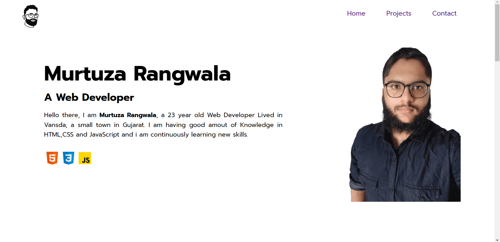

# Personal Portfolio Project

## Murtuza Rangwala

## What I learned from this Project?

- I learn to think about UI.

- I also learned about which types of images we should use.

- I also learned to find Useful resources from Internet(It takes most of the Times).

- This project took around 4 hours to complete.

## Live Link of the Project:

[Live Project Link](https://murtuzarangwala.netlify.app/)

## Output:

